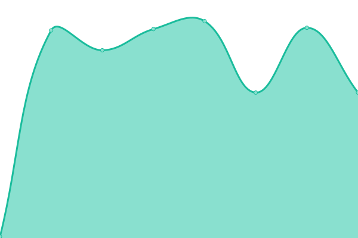
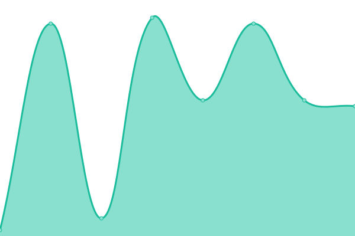
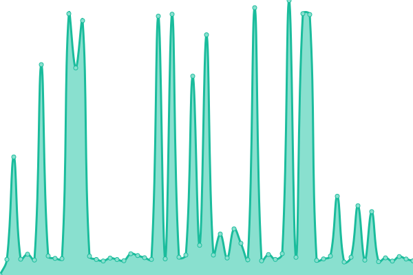
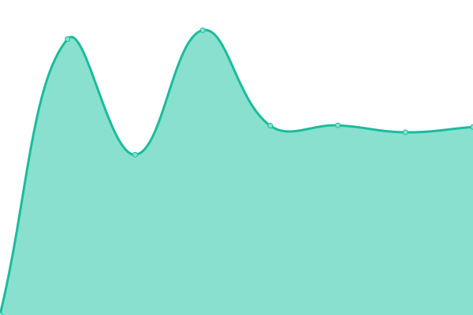
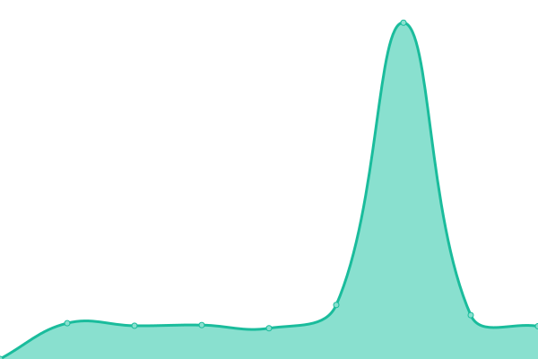

# [📈 Live Status](https://status.proxeuse.com): <!--live status--> **🟧 Partial outage**

This repository contains the open-source uptime monitor and status page for [Proxeuse](https://www.proxeuse.com), powered by [Upptime](https://github.com/upptime/upptime).

With [Upptime](https://upptime.js.org), you can get your own unlimited and free uptime monitor and status page, powered entirely by a GitHub repository. We use [Issues](https://github.com/Proxeuse/status/issues) as incident reports, [Actions](https://github.com/Proxeuse/status/actions) as uptime monitors, and [Pages](https://status.proxeuse.com) for the status page.

<!--start: status pages-->
<!-- This summary is generated by Upptime (https://github.com/upptime/upptime) -->
<!-- Do not edit this manually, your changes will be overwritten -->
<!-- prettier-ignore -->
| URL | Status | History | Response Time | Uptime |
| --- | ------ | ------- | ------------- | ------ |
|  [API - Cloud Servers](api.hetzner.cloud) | 🟩 Up | [api-cloud-servers.yml](https://github.com/Proxeuse/status/commits/HEAD/history/api-cloud-servers.yml) | 

 166ms
     
 | 

<a href="https://status.proxeuse.com/history/api-cloud-servers">100.00%</a>
    

|  [API - Domain Registration](api.openprovider.eu) | 🟩 Up | [api-domain-registration.yml](https://github.com/Proxeuse/status/commits/HEAD/history/api-domain-registration.yml) | 

 142ms
     
 | 

<a href="https://status.proxeuse.com/history/api-domain-registration">100.00%</a>
    

|  [API - Payments via PayPal](api-m.paypal.com) | 🟩 Up | [api-payments-via-pay-pal.yml](https://github.com/Proxeuse/status/commits/HEAD/history/api-payments-via-pay-pal.yml) | 

 36ms
     
 | 

<a href="https://status.proxeuse.com/history/api-payments-via-pay-pal">100.00%</a>
    

|  [API - Payments via Stripe](api.stripe.com) | 🟩 Up | [api-payments-via-stripe.yml](https://github.com/Proxeuse/status/commits/HEAD/history/api-payments-via-stripe.yml) | 

 36ms
     
 | 

<a href="https://status.proxeuse.com/history/api-payments-via-stripe">100.00%</a>
    

|  Nextcloud - Storage Backend | 🟩 Up | [nextcloud-storage-backend.yml](https://github.com/Proxeuse/status/commits/HEAD/history/nextcloud-storage-backend.yml) | 

 170ms
     
 | 

<a href="https://status.proxeuse.com/history/nextcloud-storage-backend">100.00%</a>
    

|  [Plesk - Falkenstein (DE)](cloud.proxweb.eu) | 🟩 Up | [plesk-falkenstein-de.yml](https://github.com/Proxeuse/status/commits/HEAD/history/plesk-falkenstein-de.yml) | 

 197ms
     
 | 

<a href="https://status.proxeuse.com/history/plesk-falkenstein-de">100.00%</a>
    

|  [Service - Customer Portal](https://my.proxeuse.com) | 🟩 Up | [service-customer-portal.yml](https://github.com/Proxeuse/status/commits/HEAD/history/service-customer-portal.yml) | 

 1918ms
     
 | 

<a href="https://status.proxeuse.com/history/service-customer-portal">100.00%</a>
    

|  [Service - Documentation](https://docs.proxeuse.com) | 🟩 Up | [service-documentation.yml](https://github.com/Proxeuse/status/commits/HEAD/history/service-documentation.yml) | 

 1123ms
     
 | 

<a href="https://status.proxeuse.com/history/service-documentation">100.00%</a>
    

|  [Service - Downloads Portal](https://downloads.proxeuse.nl) | 🟩 Up | [service-downloads-portal.yml](https://github.com/Proxeuse/status/commits/HEAD/history/service-downloads-portal.yml) | 

 1914ms
     
 | 

<a href="https://status.proxeuse.com/history/service-downloads-portal">100.00%</a>
    

|  [Service - Help Center](https://help.proxeuse.com) | 🟥 Down | [service-help-center.yml](https://github.com/Proxeuse/status/commits/HEAD/history/service-help-center.yml) | 

 525ms
     
 | 

<a href="https://status.proxeuse.com/history/service-help-center">20.87%</a>
    

|  [Service - Portainer](https://portainer.proxeuse.com) | 🟩 Up | [service-portainer.yml](https://github.com/Proxeuse/status/commits/HEAD/history/service-portainer.yml) | 

 646ms
     
 | 

<a href="https://status.proxeuse.com/history/service-portainer">100.00%</a>
    

|  [Service - Pterodactyl](https://pterodactyl.proxeuse.com) | 🟩 Up | [service-pterodactyl.yml](https://github.com/Proxeuse/status/commits/HEAD/history/service-pterodactyl.yml) | 

 809ms
     
 | 

<a href="https://status.proxeuse.com/history/service-pterodactyl">98.77%</a>
    

<!--end: status pages-->

[**Visit our status website →**](https://status.proxeuse.com)

## 📄 License

- Powered by: [Upptime](https://github.com/upptime/upptime)
- Code: [MIT](./LICENSE) © [Proxeuse](https://www.proxeuse.com)
- Data in the `./history` directory: [Open Database License](https://opendatacommons.org/licenses/odbl/1-0/)
